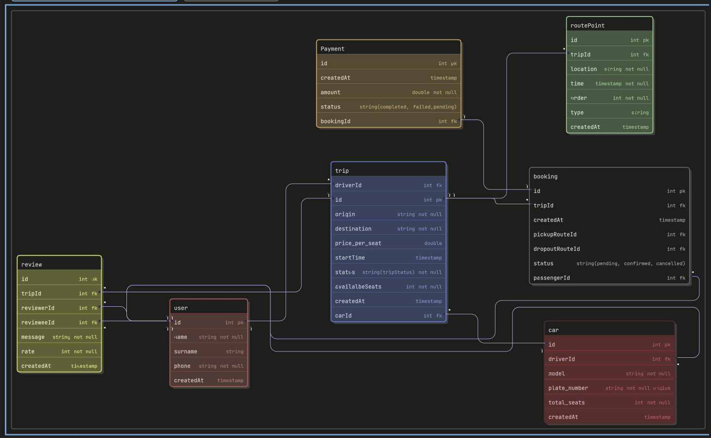

# *Description*

### *carpooling platform designed for small towns and rural areas where traditional taxi services are limited or expensiv drivers can create trips by specifying departure and destination locations departure time, price passengers can search for available trips based on route time, and cost and book a seat*

 **Entities**

1. **user**
2. **trip**
3. **payment**
4. **booking**
5. **review**
6. **car(driver must register car)**
7. **routePoints**

roles -> Admin , pessanger, driver

# User Entity – Functional Requirements

### User Management

* As a  **guest** , I can register a new account.
* As an  **authenticated user** , I can view my own profile  **(auth)** .
* As an  **authenticated user** , I can update my own profile  **(auth, owner-only)** .
* As an  **authenticated user** , I can delete my own account  **(auth, owner-only)** .

---

### Public User Discovery

* As an  **authenticated user** , I can search users by full name  **(auth)** .
* As an  **authenticated user** , I can view another user’s public profile  **(auth)** .

---

### Admin User Management

* As an  **authenticated admin** , I can view all users with pagination  **(auth, authorization: admin)** .
* As an  **authenticated admin** , I can update any user account  **(auth, authorization: admin)** .
* As an  **authenticated admin** , I can delete any user account  **(auth, authorization: admin)** .

# Authorization Rules

Role-based access control is enforced.

### Roles in the system

* `admin`
* `driver`
* `passenger`

---

### Authorization Logic

* Only **admin** can list all users.
* Only **admin** can update or delete other users.
* Users can only update or delete  **their own accounts** .
* Any authenticated user can view public profiles of other users.
* Any authenticated user can search for users.

| Method | Endpoint                | Description                    | Access        |
| ------ | ----------------------- | ------------------------------ | ------------- |
| GET    | `/users/me`           | Get current user profile       | Authenticated |
| PATCH  | `/users/me`           | Update own profile             | Authenticated |
| DELETE | `/users/me`           | Delete own account             | Authenticated |
| GET    | `/users/search`       | Search users by name           | Authenticated |
| GET    | `/users/{user_email}` | Get user by email              | Authenticated |
| GET    | `/users`              | List all users with pagination | Admin         |
| PATCH  | `/users/{user_email}` | Update any user                | Admin         |
| DELETE | `/users/{user_email}` | Delete any user                | Admin         |

---

# Security Constraints

* Only the account owner or admin can modify a user profile.
* Unauthorized actions raise a **403 Forbidden** error.
* Access control is implemented using  **RoleChecker dependencies** .

Example:

<pre class="overflow-visible! px-0!" data-start="2692" data-end="2766">

allow_admin allow_driver allow_passenger allow_driver_or_passenger

</pre>

---

# Edge Cases (User)

* User cannot update another user’s profile unless they are  **admin** .
* User cannot delete another user’s account unless they are  **admin** .
* Searching users with an empty query is not allowed.
* Attempting to access a non-existing user returns  **UserNotFoundByEmail** .
* Unauthorized access returns  **AccessForbidden** .

# CAR

- As an **authenticated driver**, I can register my car **(auth, authorization: driver)**
- As an **authenticated driver**, I can view my active car **(auth, authorization: driver, owner-only)**
- As an **authenticated driver**, I can update my own car **(auth, authorization: driver, owner-only)**
- As an **authenticated driver**, I can delete my own car **(auth, authorization: driver, owner-only)**
- As an **authenticated driver**, I can have only one active car at a time **(auth, authorization: driver)**
- As an **authenticated admin**, I can view any car **(auth, authorization: admin)**
- As an **authenticated admin**, I can delete any car if needed for moderation **(auth, authorization: admin)**

### Authentication Scenarios

- Only authenticated users can create, update, or delete cars.
- Only authenticated users can view private car ownership information.
- JWT access token is required for car management endpoints.
- A valid authenticated user must be identified before linking a car to a driver.

### Authorization Scenarios

- Only users with role `driver` or `admin` can register a car.
- Only the owner driver can update or delete their own car.
- Only the owner driver can view their own active car.
- Admin can view or delete any car.
- Passenger cannot create, update, or delete a car.

### Edge Cases

- A driver cannot have more than one active car at the same time.
- A car cannot be registered with a duplicate plate number.
- A passenger cannot register a car.
- Car seat count cannot be reduced below the number of already booked seats in future trips.
- A banned or inactive driver cannot create or manage a car.
- A car with invalid plate number format must be rejected.
- A car cannot be created without model, plate number, or total seats.
- A deleted car cannot be updated.
- A driver cannot update or delete another driver’s car.

# TRIP

### User Stories

* As an  **authenticated driver** , I can create a trip **(auth, authorization: driver)**
* As an  **authenticated driver** , I can update my own trip **(auth, authorization: driver, owner-only)**
* As an  **authenticated driver** , I can delete my own trip **(auth, authorization: driver, owner-only)**
* As an  **authenticated driver** , I can mark my trip as completed **(auth, authorization: driver, owner-only)**
* As an  **authenticated passenger** , I can view available trips **(auth)**
* As an  **authenticated passenger** , I can search trips by route **(auth)**

### Authentication Scenarios

* Only authenticated drivers can create trips.
* Only authenticated users can view trip details.
* JWT access token is required for trip management endpoints.

### Authorization Scenarios

* Only users with role `driver` can create trips.
* Only the trip owner can update or delete a trip.
* Only the trip owner can mark a trip as completed.
* Admin can view any trip.

### Edge Cases

* A driver cannot create a trip without having an active car.
* A trip start time cannot be in the past.
* Trip origin and destination cannot be the same.
* Available seats cannot exceed the car’s total seats.
* A trip that has already started cannot be modified.
* A trip that has been completed cannot be modified or deleted.

---

# ROUTE POINTS

### User Stories

* As an  **authenticated driver** , I can add route points to my trip **(auth, authorization: driver, owner-only)**
* As an  **authenticated driver** , I can update route points **(auth, authorization: driver, owner-only)**
* As an  **authenticated driver** , I can delete route points **(auth, authorization: driver, owner-only)**
* As an  **authenticated passenger** , I can view route points of a trip **(auth)**

### Authentication Scenarios

* Only authenticated drivers can create, update, or delete route points.
* JWT access token is required for route point management.

### Authorization Scenarios

* Only the driver who owns the trip can manage route points.
* Passengers can only view route points.
* Admin can view route points of any trip.

### Edge Cases

* Route points must belong to the same trip.
* Route point order values must be unique within a trip.
* Route point time cannot exceed trip start time.
* Pickup route point must come before dropoff route point.
* Route points cannot be modified once the trip has started.
* A route point cannot be created with missing location or invalid order.

---

# BOOKING

### User Stories

* As an  **authenticated passenger** , I can create a booking for a trip **(auth, authorization: passenger)**
* As an  **authenticated passenger** , I can view my bookings **(auth, owner-only)**
* As an  **authenticated passenger** , I can cancel my booking **(auth, owner-only)**
* As an  **authenticated driver** , I can view bookings for my trip **(auth, authorization: driver, owner-only)**

### Authentication Scenarios

* Only authenticated passengers can create bookings.
* JWT access token is required for booking operations.

### Authorization Scenarios

* Passengers can only manage their own bookings.
* Drivers can only view bookings for trips they own.
* Admin can view any booking.

### Edge Cases

* A passenger cannot book their own trip.
* A passenger cannot create duplicate bookings for the same trip.
* A booking cannot be created if no seats are available.
* Pickup route point must come before dropoff route point.
* Booking cannot be created for a completed trip.
* A cancelled booking cannot be cancelled again.

---

# PAYMENT

### User Stories

* As an  **authenticated passenger** , I can pay for my booking **(auth, owner-only)**
* As an  **authenticated passenger** , I can view payments for my booking **(auth, owner-only)**

### Authentication Scenarios

* Only authenticated passengers can make payments.
* JWT access token is required for payment endpoints.

### Authorization Scenarios

* Only the passenger who owns the booking can make or view payments.
* Admin can view any payment.

### Edge Cases

* Payment cannot be created for a non-existing booking.
* Payment cannot be made for a cancelled booking.
* A booking can only be paid once.
* Payment amount must be positive.
* Duplicate payments for the same booking are not allowed.

---

# REVIEW

### User Stories

* As an  **authenticated passenger** , I can leave a review for a driver after a trip **(auth)**
* As an  **authenticated driver** , I can leave a review for a passenger after a trip **(auth)**
* As an  **authenticated user** , I can update my review **(auth, owner-only)**
* As an  **authenticated user** , I can delete my review **(auth, owner-only)**
* As a  **user** , I can view reviews about another user.

### Authentication Scenarios

* Only authenticated users can create, update, or delete reviews.
* JWT access token is required for review operations.

### Authorization Scenarios

* Only the review author can update or delete the review.
* Users can only review participants of the same trip.
* Admin can view any review.

### Edge Cases

* A user cannot review themselves.
* Reviews can only be created for completed trips.
* A user can review another user only if both participated in the same trip.
* Duplicate reviews for the same trip and users are not allowed.
* Rating must be between 1 and 5.

## **basic Functional Requirements ->>**

**User can DO:**

* **users can register , delete, update, view his account**
* **users can view all public accounts**
* **users can search public account by fullname**
* **can view reviews about a user.**
* can view all my trips
* **users can view all available trips , seat count**
* **users can create,update , delete  review (drivers to passenger and passenger to driver after completed trip) after trip is completed.**

**Drivers CAN DO**

* **Drivers can create trip**
* **Drivers can update , delete trip (only before 24 hours to trip)**
* **Drivers can register, update , delete  car (only one car at a time)**
* **Driver can mark trip as Completed after trip**
* **Drivers can create routePoints**
* **Driver can view passengers which booked his trip**

**Passenger CAN DO**

* **Passengers can create booking (book seat by looking routePoints)**
* **passengers can view all trip**
* **passenger can search trip by routePoints**
* **can cancel booking**
* **Passenger pay money / create new payment**

## **final Functional Requiremets  ->>**

## User

* As a user, I can register an accoun
* As a User, I can update my account
* As a user, I can delete my account
* As a User, I can view my profile
* As a User, I can view public profiles of other users
* As a User, I can search users by full name
* As a User, I can view reviews about a user
* As a User, I can view all my trips (as driver or passenger)

## Trip

* As a driver, I can create a Trip.
* As a driver, I can update a Trip (only more than 24 hours before departure)
* As a driver, I can delete a Trip (only more than 24 hours before departure)
* As a driver, I can mark a Trip as completed
* As a passenger, I can view all available Trips
* As a passenger, I can search Trips by route points
* As a passenger, I can see available seat count

## Car

* As a driver, I can register one Car
* As a driver, I can update my car
* As a driver, I can delete my car
* As a Driver, I can have only one active Car at a time

## RoutePoint

* As a Driver, I can add RoutePoints to a Trip
* As a Passenger, I can search Trips using RoutePoints

## Booking

* As a Passenger, I can book a seat in a Trip
* As a Passenger, I can cancel my Booking
* As a Driver, I can view all Bookings for my Trip

## Payment

* As a Passenger, I can create a Payment for a Booking
* As a User, I can view my Payment history
* As a Passenger, I can see payment status

## Review

* As a passenger, I can create a Review after a completed Trip
* As a Driver, I can create a Review for a Passenger after a completed Trip
* As a User, I can update my Review
* As a User, I can delete my Review

colorModebold

styleModeshadow

typefacemono

notationchen

user[color:red]{

  idintpk

  namestringnot null

  surnamestring

  phonestringnot null

  createdAttimestamp

}

review[color:yellow]{

  idintpk

  tripIdintfk

  reviewerIdintfk

  revieweeIdintfk

  messagestringnot null

  rateintnot null

  createdAttimestamp

}

trip[color:blue]{

  idintpk

  driverIdintfk

  carIdintfk

  originstringnot null

  destinationstringnot null

  price_per_seatdouble

  startTimetimestamp

  statusstring(tripStatus)not null

  availalbeSeatsintnot null

  createdAttimestamp

}

routePoint[color:green]{

  idintpk

  tripIdintfk

  locationstringnot null

  timetimestampnot null

  orderintnot null

  typestring

  createdAttimestamp

}

booking[color:white]{

  idintpk

  passengerIdintfk

  tripIdintfk

  createdAttimestamp

  pickupRouteIdintfk

  dropoutRouteIdintfk

  status string(pending, confirmed, cancelled)

}

Payment[color:orange]{

  idintpk

  bookingIdintfk

  createdAttimestamp

  amountdoublenot null

  status string(completed, failed,pending)

}

car[color:pink]{

  idintpk

  driverIdintfk

  modelstringnot null

  plate_numberstringnot null unqiue

  total_seatsintnot null

  createdAttimestamp

}

car.driverId>user.id

user.id<trip.driverId

review.reviewerId>user.id

review.revieweeId>user.id

trip.id<booking.tripId

trip.id<routePoint.tripId

booking.passengerId>user.id

Payment.bookingId-booking.id

review.tripId>trip.id

trip.carId>car.id

